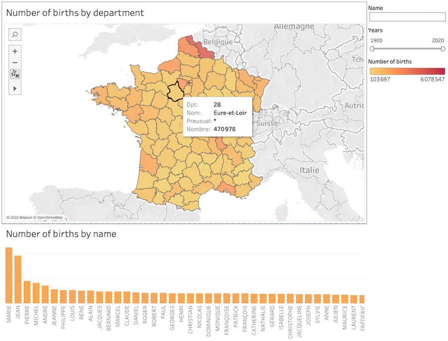

<h1><font size=5>IGR204 - mini-project "Baby Names"- group H</font></h1>
<i>Louis Beaulieu<br>
Sara Boutigny<br>
Julien Lair<br>
Hugo Michel<br>
Mouhamadou Moustapha Niane<br><br></i>

<p>In this mini-project, we will be working with a data set of baby names in France. It contains the list of all baby names registered in France, year by year, from 1900 through 2019. There are two data sets: one aggregated to the national level, and another with data by department. Your goal is to create 3 different visualizations around these data, each focussed on answering different kinds of questions about the data:

- Visualization 1: How do baby names evolve over time? Are there names that have consistently remained popular or unpopular? Are there some that have were suddenly or briefly popular or unpopular? Are there trends in time?
- Visualization 2: Is there a regional effect in the data? Are some names more popular in some regions? Are popular names generally popular across the whole country?
- Visualization 3 (bonus): Are there gender effects in the data? Does popularity of names given to both sexes evolve consistently? (Note: this data set treats sex as binary; this is a simplification that carries into this assignment but does not generally hold.)</p>

<i><b>NOTE : for the Tableau visualizations (1 and 2), it may be necessary to repair the connexions when opening the files *.twb to be able to read the sources (attached with the files).</b></i>

<h1>Visualization 1</h1>

This visualization is made with Tableau and is presented in the file <b>Dashboard_Visualization1.twb</b>. To be able to see it, it's necessary to download and unzip the file <b><a href="https://github.com/lbeaulieu-git/baby_names/raw/main/Viz1.zip">Viz1.zip</a></b> on this repo.

We build a data preprocessing pipeline in order to preprocess our several dataset : 
1/ Drop useless data such as ``_PRENOMS_RARES`` and ```XXXX`` in annais field
2/ Combine two dataset to map the number of the french department with the name of the department


#### - First Viz : TOP 5 most popular baby name evolution over time
_Are there names that have consistently remained popular or unpopular?_
_Are there some that have were suddenly or briefly popular or unpopular?_

This graph shows the evolution of the top 5 names from 1900 to 2020. 
We can see that these 5 most popular names from our dataset vary from year to year.
We can see that these 5 names don't always stay the most popular according to the years. For example, the first name "Jean" was very popular in the 50's then this popularity has diminished over the years and especially in the 2000's.


#### - Second Viz : TOP 5 most unpopular baby name evolution over time
_Are there names that have consistently remained popular or unpopular?_
_Are there some that have were suddenly or briefly popular or unpopular?_

We can see that these 5 most unpopular names from our dataset don't vary from year to year. 
Indeed, it turns out that the unpopularity of these 5 names remains constant over time. We therefore conclude that unpopular names seem to remain unpopular over time. For example, the name "AAHIL" has been attributed only 3 times to an individual from 1900 to 2020


#### - Third Viz : TOP 5 popular names each year
_How do baby names evolve over time?_

This bar-chart differs from the line-graph above because it displays the top 5 most popular names each year. 
We can see that this top 5 changes according to the years. This confirms again that the phenomenon that the most popular names for a given year will not necessarily be the same for the following year. 


#### - Fourth Viz : TOP 5 unpopular names each year
_How do baby names evolve over time?_

This bar chart displays the top 5 least popular names for each year
We can observe that this top 5 remains constant every year. This means that the least popular names remain unpopular over time


#### - Fifth Viz : Baby names Evolutions
_How do baby names evolve over time?_
_Are there trends in time ?_

For one or more given names, this graph displays the evolution of the names
This graph allows you to observe the evolution of one or more names over time. 
The advantage of this graph is that it shows the trends of the attribution of names over the years. It is easy to observe the effects of seasonality (for example, names come back popular every 4 years)


<h1>Visualization 2</h1>

This visualization is made with Tableau and is presented in the file <b>Viz2.twb</b>. To be able to see it, it's necessary to download and unzip the file <b><a href="https://github.com/lbeaulieu-git/baby_names/raw/main/Viz2.zip">Viz2.zip</a></b> on this repo. The main Tableau file and the 2 datasets used are in it.
  
We want at the same time a regional visualization and a vision of popular names. Considering this, a regional map linked to a bar chart representing respectively the number of births by department and by name is appropriate. We can add a filter to watch the effects of a particular name or year on the data.
The prototype sketch looks like this :


  
The final visualization in Tableau looks like this :
  

  

  


<h1>Visualization 3</h1>

This visualization is made with Altair and is presented in the Zip file <b><a href="https://github.com/lbeaulieu-git/baby_names/raw/main/Viz3.zip">Viz3.zip</a></b> on this repo.

The pyramid visualization allows us to answer the question of the evolution of gender in the data: here, a part of the departments is represented, with the volume of males on one side and the volume of females on the other. A slider allows to observe the evolution every 10 years.

More precisely, we can notice that each department has the same proportion of male and female names given over time. The number of male and female names given to newborns increases over time in all departments: this is due to the increase of the global population in the country. However we can notice a strong rebound of the population in Guyana, we went from a population of 150 new born with a male name and 150 new born with a female name in 1900 to more than 2000 new born with a male name and nearly 1800 new born with a female name.

A screenshot of the pyramid can be found bellow :


